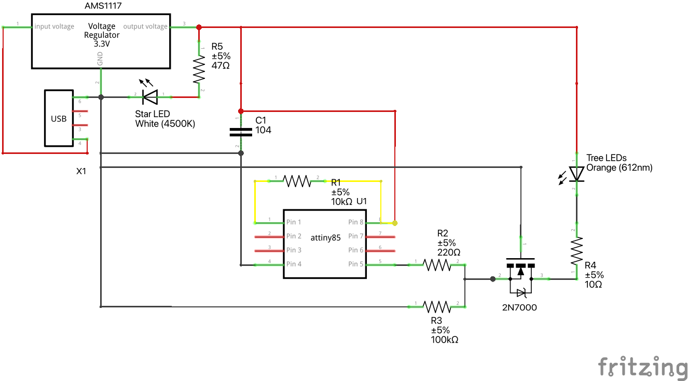

# XmasMorseLed - Morse Code Christmas Fairy Lights ✨

[![PlatformIO CI](https://img.shields.io/badge/PlatformIO-Ready-orange?logo=data%3Aimage%2Fsvg%2Bxml%3Bbase64%2CPHN2ZyB3aWR0aD0iMjUwMCIgaGVpZ2h0PSIyNTAwIiB2aWV3Qm94PSIwIDAgMjU2IDI1NiIgeG1sbnM9Imh0dHA6Ly93d3cudzMub3JnLzIwMDAvc3ZnIiBwcmVzZXJ2ZUFzcGVjdFJhdGlvPSJ4TWlkWU1pZCI%2BPGRlZnM%2BPGxpbmVhckdyYWRpZW50IGlkPSJhIiB4MT0iLTEuOTc4JSIgeDI9IjEwMC4wMDMlIiB5MT0iNzQuMzIyJSIgeTI9IjI1Ljc3OCUiPjxzdG9wIHN0b3AtY29sb3I9IiNGRkYiIHN0b3Atb3BhY2l0eT0iMCIgb2Zmc2V0PSIwJSIvPjxzdG9wIHN0b3AtY29sb3I9IiNGRkYiIHN0b3Atb3BhY2l0eT0iLjQiIG9mZnNldD0iNjMuNDEzJSIvPjxzdG9wIHN0b3AtY29sb3I9IiNGRkYiIHN0b3Atb3BhY2l0eT0iMCIgb2Zmc2V0PSIxMDAlIi8%2BPC9saW5lYXJHcmFkaWVudD48L2RlZnM%2BPHBhdGggZD0iTTEyOCAwQzU3LjMzIDAgMCA1Ny4zMjggMCAxMjhzNTcuMzI4IDEyOCAxMjggMTI4IDEyOC01Ny4zMzIgMTI4LTEyOFMxOTguNjcyIDAgMTI4IDB6IiBmaWxsPSIjRkY3RjAwIi8%2BPHBhdGggZD0iTTI0OSAxMjhBMTIxIDEyMSAwIDEgMS0yIDEwNGE2NCA2NCAwIDEgMCAwIDQ4IDEyMC44OSAxMjAuODkgMCAwIDEgMy0yNHoiIGZpbGw9InVybCgjYSkiLz48cGF0aCBkPSJNNjQgODh2ODBsMzItMTZ2LTY0eiIgZmlsbD0iIzIzMUYyMCIvPjxwYXRoIGQ9Ik05NiAxMDRWODhsMTYtOFYxNnptMTYtODBWOGgzMnYxNnoiIGZpbGw9IiMyMzFGMjAiLz48cGF0aCBkPSJNMTI4IDE2djY0aDE2Vjg4aC00OHoiIGZpbGw9IiMyMzFGMjAiLz48cGF0aCBkPSJNMTQ0IDE2djcyaDMyVjY0aDE2VjE2eiIgZmlsbD0iIzIzMUYyMCIvPjxwYXRoIGQ9Ik0xNDQgODhoMTZ2MjRIMTYwVjk2aDMydjE2aC00OHoiIGZpbGw9IiMyMzFGMjAiLz48cGF0aCBkPSJNMTkyIDY0djQ4aDE2VjY0eiIgZmlsbD0iIzIzMUYyMCIvPjxwYXRoIGQ9Ik0xOTIgMTEydjhIOTZWOTZoOTZ6IiBmaWxsPSIjMjMxRjIwIi8%2BPC9zdmc%2B)](https://platformio.org/)
[](LICENSE)
[](https://www.microchip.com/wwwproducts/en/ATtiny85)

A festive Arduino project that transforms Christmas fairy lights into a Morse code transmitter using an ATtiny85 microcontroller. Perfect for adding a geeky twist to your holiday decorations! 🎄

## 🎯 Features

- **Morse Code Transmission**: Converts text messages into blinking LED patterns
- **Customizable Messages**: Easily change the displayed message in the source code
- **Adjustable Speed**: Configure WPM (Words Per Minute) for optimal readability
- **Low Power**: Uses ATtiny85 for efficient battery operation
- **Extensible**: Modular architecture for easy customization

## 📷 Demo



## 🧰 Components List (BOM)

### Core Components


- **ATtiny85 DIP-8** (+ optional socket)
- **AMS1117-3.3V** voltage regulator module (HW-764)
- **N-Channel MOSFET** logic level (2N7000 or BS170)
- **Red LED strip** (~3V, 50mA)

### Passive Components


- **Capacitor**: 100nF (between 3.3V and GND)
- **Resistors**:
  - 10kΩ (RESET pull-up)
  - 220Ω (gate series resistor)
  - 100kΩ (gate pull-down)
  - 10Ω 1/4W (LED strip current limiting)

### Connectivity


- **USB cable/connector** (5V power supply)
- **2-way terminal block** (LED strip connection)
- **Breadboard or perfboard**
- **Jumper wires** or solid core wire

### Programming (Required for Upload)


- **Arduino board** (as ISP programmer)
- **Jumper wires** for ISP connections

## 🚀 Quick Start

### Prerequisites

1. **Install PlatformIO**
   - CLI: `pip install platformio`
   - VS Code: Install PlatformIO IDE extension

2. **Set up Arduino as ISP**
   - Connect Arduino to ATtiny85 (MISO/MOSI/SCK/RESET)
   - Define `UPLOAD_PORT` with your ISP's serial port

### Installation & Usage

```bash
# Clone the repository
git clone <repository-url>
cd XmasMorseLed

# Configure your message and settings in src/main.cpp
# MESSAGE: Text to transmit in Morse code
# LED_PIN: Output pin (default: PB0)
# WPM: Transmission speed (12-25 recommended for visual reading)

# Build the project
pio run

# Upload to ATtiny85
pio run -t upload
```

### Configuration

Edit `src/main.cpp` to customize your project:

```cpp
const uint8_t LED_PIN = 0;        // PB0 on ATtiny85
const uint8_t WPM = 25;           // Words per minute
const char* const MESSAGE = "FELIZ NATAL!";  // Your message
```

## ⚙️ Technical Specifications

### Hardware Setup

- **Microcontroller**: ATtiny85 @ 8MHz (internal clock)
- **Output**: Pin PB0 drives MOSFET for LED strip switching
- **Power**: 5V (USB) regulated to 3.3V, common GND with ISP programmer

### Transmission Configuration


- **Speed Control**: WPM controls timing (dot duration = 1200/WPM ms)
- **Supported Characters**: Only characters in `include/MorseTable.h` are transmitted
- **Word Spacing**: Consecutive spaces count as single inter-word intervals
- **Continuous Loop**: Message repeats indefinitely with pause between cycles

### Recommended Settings


- **WPM Range**: 12-25 for comfortable visual reading
- **Voltage**: 3.3V operation for reliability
- **Current**: ~50mA LED strip consumption

## 📁 Project Architecture

```text
├── src/
│   ├── main.cpp                 # Main application and configuration
│   ├── MorseTransmitter.cpp     # Morse code transmission logic
│   └── MorseTable.cpp           # Morse code lookup table
├── include/
│   ├── MorseTransmitter.h       # Transmitter class interface
│   └── MorseTable.h             # Morse table definitions
├── docs/
│   └── schematics.png           # Circuit schematic diagram
└── platformio.ini               # PlatformIO configuration
```

### Key Classes

- **`MorseTransmitter`**: Handles character-to-pulse conversion and LED control
- **`MorseTable`**: PROGMEM-stored Morse code lookup table with utility functions
- **`main.cpp`**: Application entry point with user-configurable parameters

## 🔧 Development

### Building from Source

```bash
# Clean build
pio run --target clean

# Build only
pio run

# Build and upload
pio run --target upload
```

### ISP Configuration

The project uses `platformio.ini` configuration for ATtiny85:
- Target: `attiny85` @ 8MHz
- Upload Protocol: `stk500v1` @ 19200 bps via ArduinoISP

## 📋 Troubleshooting

### Common Issues

1. **Upload Fails**: Check ISP connections and `UPLOAD_PORT` setting
2. **LED Not Blinking**: Verify MOSFET wiring and power supply
3. **Wrong Speed**: Adjust `WPM` value in `main.cpp`
4. **Characters Not Transmitted**: Ensure characters exist in `MorseTable.h`

### Debug Tips


- Use a multimeter to verify voltage levels
- Check all connections match the schematic
- Verify ATtiny85 fuse settings for internal 8MHz clock

## 🤝 Contributing

Contributions are welcome! Please feel free to submit pull requests or open issues for:

- Bug fixes
- Feature enhancements
- Documentation improvements
- Additional Morse code characters

## 📄 License

This project is licensed under the MIT License - see the [LICENSE](LICENSE) file for details.

## 🎄 Happy Holidays

Enjoy your blinking Morse code Christmas lights and spread some geeky holiday cheer! ✨

---

Made with ❤️ for makers and electronics enthusiasts
