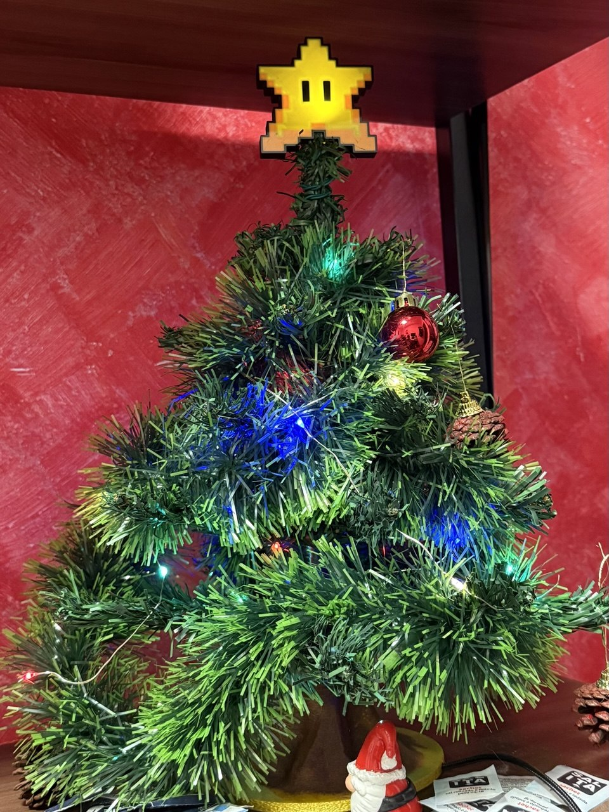
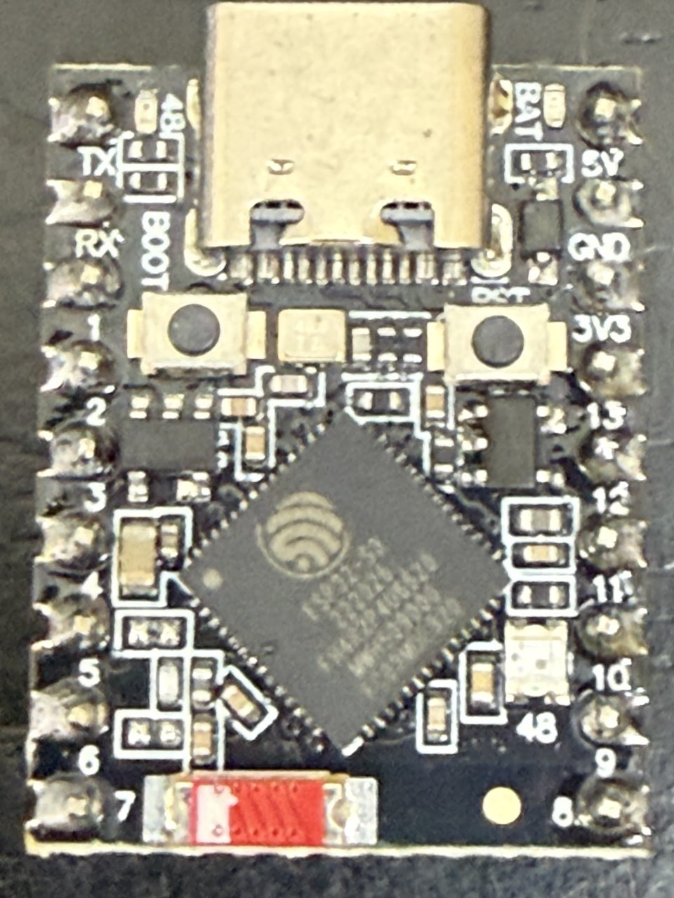
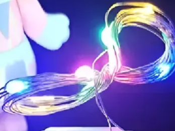

# 🎄 XmasMorseLed 2.0

**A little Christmas tree with something to say.**

Give your Christmas lights a message of their own. XmasMorseLed turns a greeting into short and long blinks in Morse code, while the star keeps shining above it all. Pick the words and the pace from your phone, then let the tree do the talking.

  

<em>A few lights, a bright star, and a Christmas wish hidden in the blinking.</em>

## ✨ A greeting in every blink

The tree starts with **FELIZ NATAL!** — Portuguese for **Merry Christmas!** You can keep that greeting, send someone a little message, or invite the family to guess what the lights are saying.

- **Make it personal.** Change the message from a page on your phone.
- **Set the pace.** Choose how quickly the lights tell their story.
- **Come back to your greeting.** Your message and speed are remembered after the power is unplugged.
- **Keep it local.** The tree creates its own Wi-Fi network. No internet, account or app installation is needed.

In Morse code, a short blink is a dot and a longer blink is a dash. The pauses separate the letters and words. Once the greeting is finished, the tree starts again — even after you put your phone away.

## 🎁 Give the tree a message

Once your tree is assembled and programmed:

1. **Plug it in** using its USB power supply.
2. **Join its Wi-Fi**, named `XmasMorseLed-XXXXXX`. There is no password. If your phone says the network has no internet, choose to stay connected.
3. **Open the little control page.** It may appear automatically or through a “sign in to network” notification. You can always open **http://192.168.4.1** while connected.
4. **Write a greeting, choose the speed, and tap “Salvar”** (Save). After a short pause, the lights begin your new message.

Try `FELIZ NATAL!`, `HO HO HO!` or `BOAS FESTAS!`. Messages can be up to **120 characters**; use letters without accents, numbers, spaces and the punctuation shown on the page. The controls are in Portuguese.

Anyone connected to the tree's open Wi-Fi can change the greeting. Automatic page opening depends on your phone, so keep the direct address handy.

## 🛠️ A small project for your Christmas corner

An **ESP32-C6 SuperMini** runs the show, and a **BC337 transistor** switches the tree lights. The star has its own light and stays on. Everything is powered from USB.

| The little controller | The Christmas sparkle |
| :---: | :---: |
|  |  |
| ESP32-C6 SuperMini | Fairy lights for the tree |

Want to make one? Start with the [parts and assembly guide](docs/hardware/README.md), then follow the [firmware setup and USB upload guide](docs/build.md). The [circuit diagram](docs/hardware/schematic.svg) and [perfboard layout](docs/hardware/perfboard.svg) show how the pieces connect.

**Still on the workbench:** the current circuit design needs physical validation. Check the board connections and follow the [hardware checklist](docs/hardware/README.md#required-bench-acceptance-pending) before powering the assembled lights.

## 📚 For curious tinkerers

The technical details have their own place, ready when you need them:

- [Build, upload and preview the control page](docs/build.md)
- [Run the tests and see what still needs checking](docs/validation.md)
- [Explore the message API and Morse timing](docs/api.md)

Made for a little tinkering and a little Christmas cheer. 🎄

Released under the [MIT License](LICENSE).
